# Multispectral Image Analysis Tool
2020 Winter Co-op project at Sungkyunkwan University

## Table of Contents

- [Introduction](#introduction)
- [Prerequisites](#prerequisites)
- [If you fail to build the solution](#if-you-fail-to-build-the-solution)
- [Usage](#usage)
  * [Open Project Folder](#open-project-folder)
  * [Image Set](#image-set)
  * [Thumbnails and Main image](#thumbnails-and-main-image)
  * [Table](#table)
  * [Add new class](#add-new-class)
  * [Save](#save)
  * [Inference](#inference)
- [Future Works](#future-works)
  * [Train](#train)
  * [Capture](#capture)
 - [Contacts](#contacts)
  
## Introduction
 이 프로그램은 Multispectral 카메라로 총 여섯 개의 파장대에서 촬영한 Image를 가져와 머신러닝을 할 수 있도록 돕는 프로그램입니다. 본 프로젝트의 목적은 Multispectral 카메라로부터 얻은 이미지를 분석 및 학습하기 위한 workflow를 구현하는 것입니다. 구체적으로, 학습을 위하여 이미지에서 원하는 부분만 가져와 모델이 학습할 수 있는 형태로 추출하고 모델로부터의 inference 결과를 시각화하여 모델을 디버깅할 수 있도록 도울 수 있습니다.
프로그램의 데모 영상은 [링크](https://drive.google.com/open?id=1-jhMmBKRA6Rk_bPgWwGc7_OFk4muC2jK)를 통해 확인하실 수 있습니다.

## Prerequisites
이 솔루션을 성공적으로 빌드하기 위해서 필요한 소프트웨어를 알려드리겠습니다.

1. Visual Studio 2019 Community

   솔루션을 빌드하기 위해서 IDE 툴이 필요하고, 이 프로그램은 Visual Studio 2019 Community에서 개발되었습니다. [링크](https://visualstudio.microsoft.com/downloads/)를 통해 해당 개발 툴을 설치하실 수 있습니다.

2. Caliburn.micro

   Windows Presentation Foundation (WPF) 개발 시, MVVM 패턴으로 코드를 작성하기 위해 이 프레임워크를 사용하였습니다. 데이터 바인딩에 필요한 INotifypropertychanged 인터페이스 이외에 MVVM 패턴을 위해 개발자 친화적인 기능을 제공합니다. Caliburn.micro는 Visual Studio에서 NuGet Package Manager를 통해 쉽게 설치할 수 있습니다.

3. EmguCV 4.2.0

   .Net Framework에서 OpenCV 라이브러리를 사용할 수 있도록 제공한 라이브러리입니다. 솔루션에 이미 reference가 추가되어 있지만, 혹시 설치가 필요할 시 Visual Studio에서 간단하게 NuGet Package Manager로 설치하거나, 직접 .dll 파일을 reference에 직접 추가하여 사용할 수 있습니다. 정의된 함수는 OpenCV와 매우 흡사하기 때문에, 먼저 상대적으로 자료가 많은 OpenCV로 필요한 기능을 확인하고 그 함수를 EmguCV docs에서 찾아 사용하시길 추천합니다.

## If you fail to build the solution
혹시 Clone하여 솔루션 빌드에 실패하셨다면, 아래를 확인해주세요.

1. The reference component *NAME* could not be found.
   위의 Warning이 발생하였다면 간단히 해결할 수 있습니다. Solution Explorer > Reference 으로 이동하시고, 오른쪽 클릭을 눌러 Properties를 선택하면 자동적으로 해당 Warning은 해결됩니다.
   
   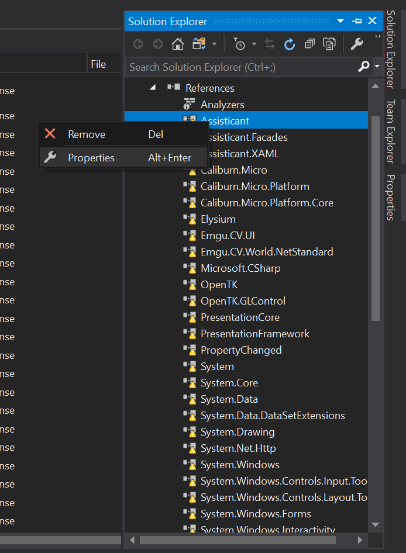

2. Emgu CV is not able to detect the project type, unloading and reloading the project may fix this problem. If you are still having difficulty, please send an email to support@emgu.com
   위 에러는 단순히 Visual Studio를 종료 후 다시 실행하는 것으로 해결할 수 있습니다.

## Usage
데모 프로그램을 사용하는 방법 및 유의할 점을 설명드리겠습니다. 아래 설명이 부담스러우신 분들은 위의 데모 동영상 링크를 통해 기능을 확인해주시면 됩니다.

### Open Project Folder
가장 먼저 분석하고자 하는 Image set을 불러와야 합니다. Image set이 있는 프로젝트 폴더는 왼쪽 상단의 Open 버튼을 통해 여실 수 있습니다. 이때 선택한 폴더가 프로젝트 폴더가 아니라고 판단될 경우, Image set의 경로를 가져오는데 실패합니다. 예를 들어, EXAMPLEPATH/Data/Block/1/600.bmp 가 Image 경로라고 하면 프로젝트 폴더는 Block입니다. 만약 Data 폴더를 선택할 시, 폴더의 깊이가 깊기 때문에(깊이가 3이상) 해당 폴더를 가져오지 않습니다. 이외에도 Image set에 모든 파장대의 사진이 존재하지 않거나 metadata가 여러 개 존재할 때도 해당합니다.

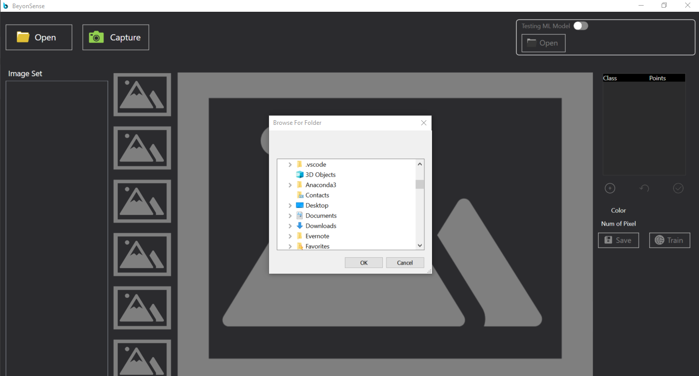
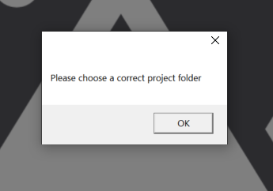

### Image Set
Image Set에는 사용자가 선택한 폴더의 계층 구조가 나타납니다. 폴더의 아이콘 및 이름을 클릭하면 하위 폴더를 열거나 닫을 수 있고, 파일의 아이콘 및 이름을 클릭하면 화면에 해당 사진을 띄울 수 있습니다.

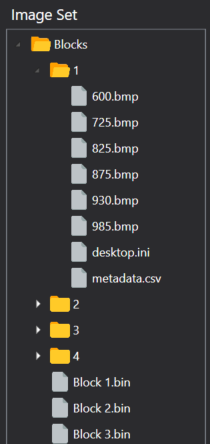

### Thumbnails and Main image
Image set에 나타난 폴더 계층 구조에서 파일을 클릭하면 해당 파일이 속한 모든 사진이 중앙의 여섯 개 Thumbnail 및 Main image에 나타납니다. 여섯개의  Thumbnail은 위에서부터 파장이 짧은 순서대로 배치하였습니다. Thumbnail 사진은 Button으로 구현하였고, 클릭을 통해 Main image에 띄울 사진을 선택할 수 있습니다.

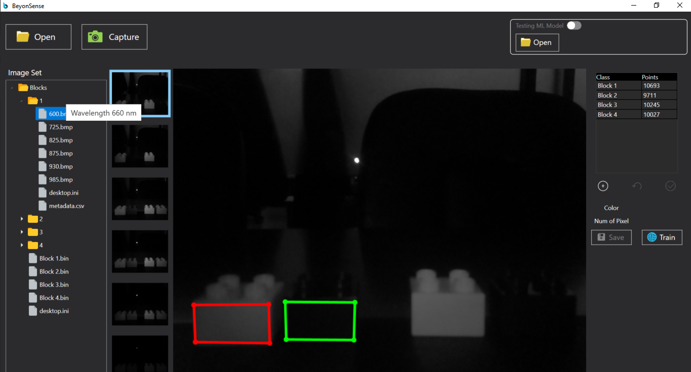

### Table
오른쪽 중앙에 위치한 Table은 해당 프로젝트 폴더의 Metadata를 나타냅니다. Class는 Class 이름, Ponits는 해당 Class에 속한 픽셀의 개수를 의미합니다. Table에 나타난 정보는 프로젝트 전체의 정보이고, 이는 각 프로젝트 폴더에 저장되어 있는 "metadata.csv"를 읽어 나타냅니다. 만약 해당 이름의 파일이 없을 경우, 기존의 metadata가 없는 것으로 간주하여 table에는 어떠한 정보도 나타나지 않습니다. 그리고 각 Class는 고유의 색을 할당 받습니다. 이는 Table의 행을 클릭하면 Table 아래 Color에 해당 Class에 할당된 색을 확인할 수 있습니다. 이 색은 이후 Main Image에서 Class를 구분할 때 이용됩니다.

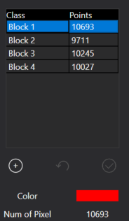

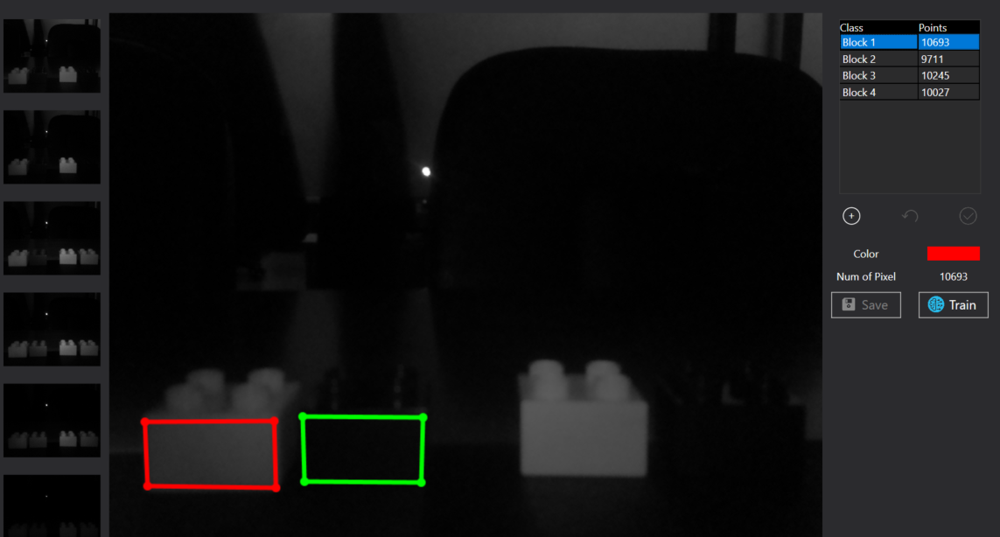

### Add new class
띄운 Image set에서 학습하고자 하는 영역이 있다면  Table 아래 + 버튼을 눌러 추가로 표시할 수 있습니다. + 버튼을 누르면 Class 이름을 적는 창이 뜨고 원하는 Class의 이름을 입력하면 Main image에 자유형 도형을 그릴 수 있습니다. 이때 도형의 색은 Class의 색입니다. 만약 입력한 Class의 이름이 이미 존재하는 Class이면 그 Class의 색과 동일한 색으로 도형이 그려질 것이고, 그렇지 않다면 고유한 색을 새롭게 할당합니다. 영역을 표시하던 중 수정이 필요하면 + 버튼 옆의 되돌리기 버튼을 누르면 바로 이전의 그림으로 넘어갈 수 있습니다. 모든 그림이 완료되었다면 체크 버튼을 눌러 영역을 완료할 수 있습니다. 체크 버튼을 누르면 자동적으로 마지막 점과 처음 점을 직선으로 이어 도형을 완성합니다. 만약 사용자가 점을 두 번 이하로 찍을 시 도형이 성립할 수 없기 때문에 이 경우는 새롭게 도형이 반영되지 않습니다. 정상적으로 도형을 그리면 해당 내부 영역에 포함된 픽셀 수를 계산하여 Table을 업데이트합니다. 

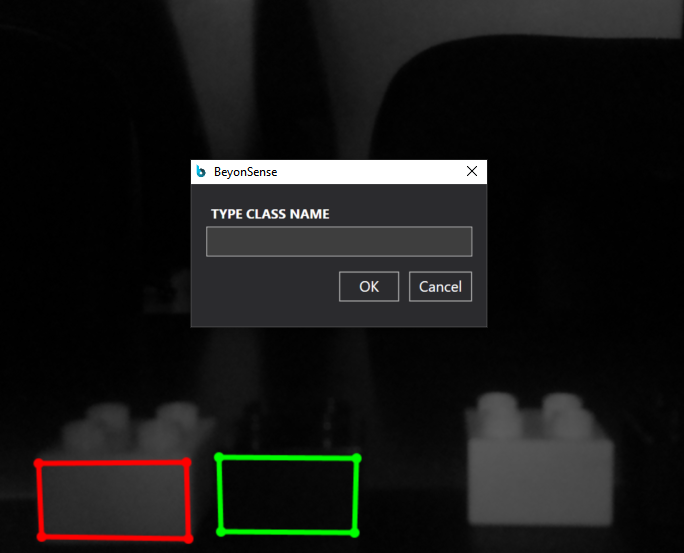

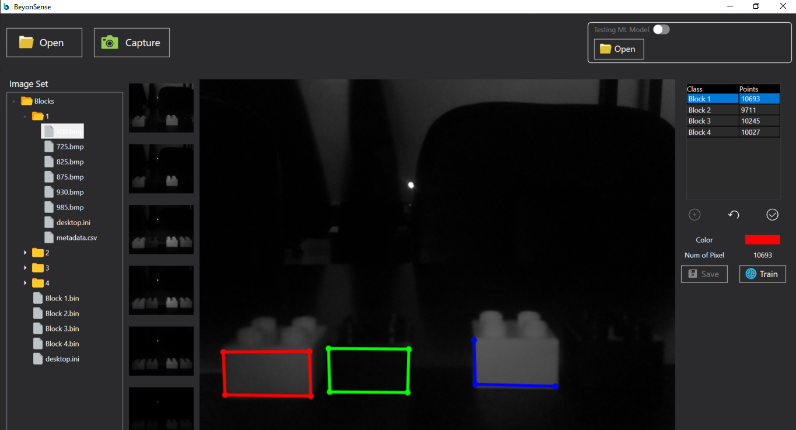

* 되돌리기

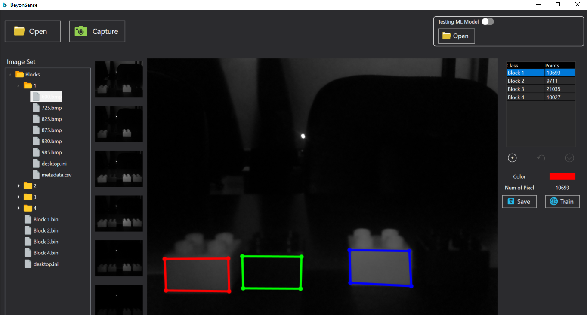

### Save
새롭게 Class를 추가하면 오른쪽 하단의 Save 버튼이 활성화 됩니다. Save 버튼을 누르면 새롭게 추가된 Class의 도형 정보를 각 Image set마다 "metadata.csv" 파일에 저장하고, Class 별로 "클래스이름.bin" 파일에 Pixel vector를 저장합니다. 이는 사용자가 특정 Class라고 명시한 픽셀 위치에 대하여 총 6개의 Image의 픽셀 밝기 값을 가져옵니다. 따라서 개발자는 이 binary file을 사용하여 자신의 모델을 학습할 수 있습니다.

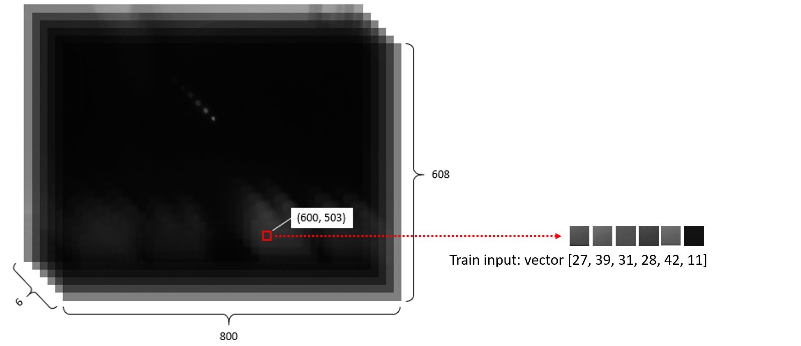

### Inference
학습된 모델이 있다면 이를 실제로 Inference할 수 있습니다. 현재 데모는 OpenCV에서 저장한 Text file 형태의 SCM 모델만 가능합니다. Main image에 사진이 띄워져있다면 오른쪽 상단의 Open 버튼이 활성화됩니다. 이 버튼을 통해 학습된 모델을 가져올 수 있습니다. 이때, "모델명_label.csv" 파일이 있어야 합니다. 이 파일을 통해 모델의 Output label 값과 Class 이름의 Mapping 정보가 저장되어 있습니다. 이 Mapping 정보를 통해 Inference 시, 결과를 Class의 할당된 색으로 보여줍니다. 파일의 Class 이름이 현재 Table에 존재하지 않는다면 회색으로 Inference 결과가 나타납니다. 만약 이 파일이 없을 경우, Inference에 실패합니다.

    // 다음은 예시 "모델명_label.csv" 입니다.
    1, Block 1
    2, Block 2
    3, Block 3
    4, Block 4

정상적으로 Inference에 성공하면, 오른쪽 상단에 모델 경로가 나타나고, Toggle 버튼이 활성화됩니다. Toggle 버튼 On/Off를 통하여 사용자가 명시한 Ground truth와 inference 결과를 비교할 수 있습니다.

모델의 Inference는 각 픽셀 단위로 진행됩니다. Pixel vector를 Input으로 받아 분류를 한 후, 해당 Pixel vector의 위치에 결과를 시각화하는 방식입니다. Image 608 x 800 의 모든 픽셀을 참조하는 것은 다소 무리한 작업이고 불필요한 배경도 포함되어 있기 때문에 이를 해결하기 위해 OpenCV의 Labeling 및 외곽선 검출 함수를 사용하여 물체를 1차적으로 판단하고, 물체라고 판단된 픽셀만 참조하여 결과를 시각화하는 방식으로 구현하였습니다.

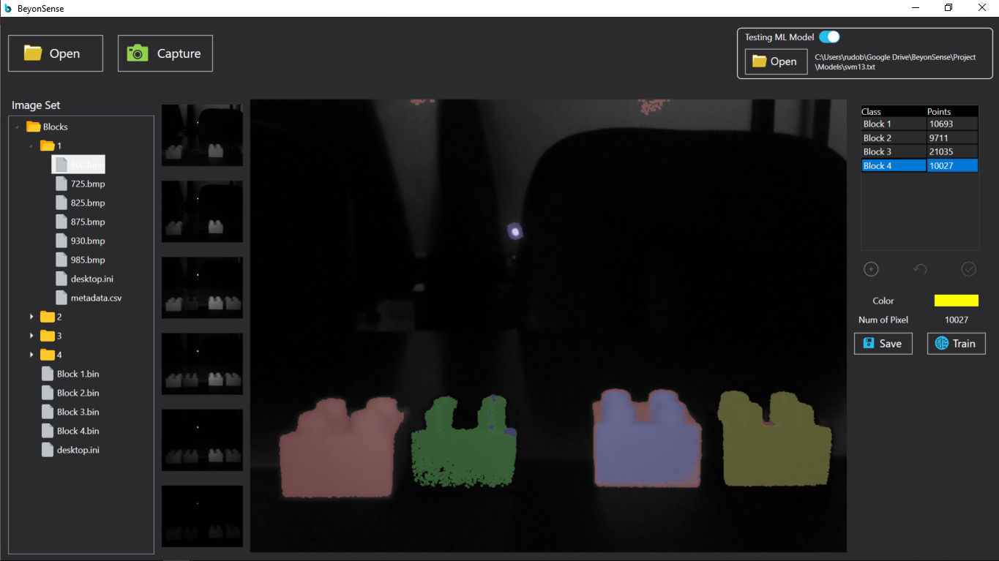

## Future Works
추가로 진행되어야 할 이슈가 두 가지 있습니다.

### Train
오른쪽 하단을 보시면 Train 버튼이 있습니다. 지금까지는 SVM으로 파라미터를 튜닝하면서 최적 모델을 찾으려고 하였으나 의미 있는 성능을 얻지 못했습니다. 따라서 일반적으로 안정적인 성능을 보이는 모델의 구조를 찾아야 합니다. 만약 이 구조를 찾으면 코드에 반영하여 사용자는 Train 버튼을 통해 몇 개의 파라미터만 조정하여 모델을 얻을 수 있도록 구현할 수 있습니다. 
[Teachablemachine](https://teachablemachine.withgoogle.com/train/image)에서 구현한 것처럼 실제 사용자가 모델의 구조를 몰라도 몇 개의 버튼으로 학습 가능하도록 하면 될 것 같습니다.

### Capture
왼쪽 상단에 Capture 버튼이 있는데, 이는 BeyonSense 카메라를 연결하여 실시간 영상에서 캡쳐하여 직접 Image set을 가져올 수 있도록 남겨둔 기능입니다.

## Contacts
**혹시 질문이 있으시거나 이슈가 있으면, 언제든지 이메일 (<rudobco0825@gmail.com>) 혹은 Github issue 남겨주세요 :)**
